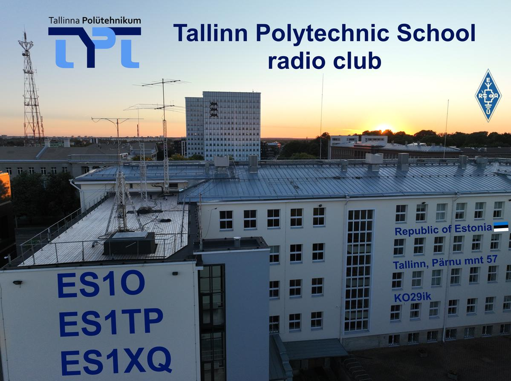

# ES1TP

Tallinn Polytechnic School Amateur Radio club station

[ES1TP QRZ](https://www.qrz.com/db/ES1TP)  
[Contest calendar](https://www.erau.ee/et/kalender)  

//TODO: ES1TP logbook

---

## Contesting

* [Submit logs](https://es7arl.carlnet.ee/ull/?p=saadalogi)
* [Rules 2025](https://www.erau.ee/images/Voistlustulemused/ULL_KV/eesti%20ull%20karikavoistlused_juhend.pdf)
* 2m contest
  * Operating notes + log setup
  * [Contest results 2025](https://es7arl.carlnet.ee/ull/?p=ULL2mKV&etapp=2025)
* 70cm contest
  * Operating notes + log setup
  * [Contest results 2025](https://es7arl.carlnet.ee/ull/?p=ULL70cmKV&etapp=2025)

---

## Settings and equipment

* WSJT-X
* Grid tracker 
* Icom IC-9700
  * Important settings 
  * [IC-9700 basic manual](https://www.hamdigitaal.nl/download/algemene-informatie/IC-9700_ENG_Basic_0.pdf)
  * [IC-9700 advanced manual](https://icomuk.co.uk/files/icom/PDF/advancedManuals/IC-9700_AdvancedManual_ENG_1.pdf)

## Links

* [PSK Reporter](https://pskreporter.info/pskmap.html)

